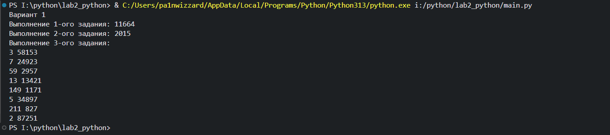

# Python. Лабораторная работа №2
## Расчётные задачи. itertools

### Условия задач

1. Тимофей составляет 5-буквенные коды из букв Т, И, М, О, Ф, Е, Й.
   Буква Й может использоваться в коде не более одного раза, при этом она не может стоять на первом месте, на последнем месте и рядом с буквой И.
   Все остальные буквы могут встречаться произвольное количество раз или не встречаться совсем. Сколько различных кодов может составить Тимофей?

2. Сколько единиц содержится в двоичной записи значения выражения
   4<sup>2020</sup> + 2<sup>2017</sup> - 15?
3. Найдите среди целых чисел, принадлежащих числовому отрезку [174457;174505], числа, имеющие ровно два различных натуральных делителя, не считая единицы и самого числа.
   Для каждого найденного числа запишите эти два делителя в два соседних столбца на экране с новой строки в порядке возрастания произведения этих двух делителей.
   Делители в строке также должны следовать в порядке возрастания. Например, в диапазоне [5; 9] ровно два различных натуральных делителя имеют числа 6 и 8, поэтому для этого диапазона вывод на экран должен содержать следующие значения:
   ```
   2 3
   2 4
   ```

### Скриншоты результатов



### Ссылки на используемые материалы

1. [Официальная документация itertools](https://docs.python.org/3/library/itertools.html)
